# Understanding and Reducing Customer Churn: A Data-Driven Retention Strategy

*DataWizards — Final Stage 1*


## Executive Summary

Customer churn is a direct threat to the premium income and profitability of PT Asuransi Sejahtera. Using data on 8,000 customers (overall churn rate 20.6%), we combined statistical driver analysis, survival analysis, interpretable regression and gradient-boosted machine learning to explain why and when customers leave and whom to prioritise. Churn is most strongly and consistently associated with payment method, auto renew and premium change pct. Churn risk is highest in tenure interval [18, 24) months. Our final model reaches an out-of-fold ROC-AUC of 0.749 (95% CI 0.735–0.761); targeting the 20% highest-risk customers captures 45% of all churners. Expected annual premium at risk is 9.83B IDR (20.5% of the premium base). We recommend: (1) Shift manual payers to automatic payment; (2) Make renewal effortless (default auto-renewal); (3) Smarter renewal pricing. A campaign simulation suggests that targeting the top 50% of customers by expected loss yields a net benefit of 792.88M IDR (ROI 1.3x) under our stated assumptions.

[EDIT: tambahkan 1 kalimat konteks spesifik dari soal (produk, pasar, tujuan manajemen) dan rapikan ringkasan ini maks. ½ halaman.]


## 1. Introduction and Business Problem

In insurance, retaining an existing policyholder is considerably cheaper than acquiring a new one: acquisition costs (commissions, marketing, underwriting) are recovered over several years of premiums, so early lapses and non-renewals directly erode profitability and persistency. [EDIT: konteks PT Asuransi Sejahtera dari soal — lini produk, situasi churn saat ini, kenapa manajemen peduli.]

This study answers three questions: (i) Which customer, policy and service factors drive churn? (ii) When during the customer lifecycle is churn risk highest? (iii) Which customers should be prioritised, and with which interventions, to maximise retained value?


## 2. Data and Methodology


### 2.1 Data

The dataset contains 8,000 customers (plus 2,000 customers to be scored) and 27 original variables covering [EDIT: demographics, policy characteristics, premium & payment behaviour, claims and service interactions]. The target is churn (churn = Yes); the overall churn rate is 20.6%.


### 2.2 Data preparation

Data preparation included automatic type correction (e.g. numbers stored as text and date parsing), harmonisation of inconsistent category labels, removal of 15 duplicate records and treatment of impossible values. We engineered 18 domain features, including tenure (years), tenure band, new customer (<12 months), age band, premium-to-income ratio, sum insured to premium ratio. Variables recorded only after churn (cancellation reason) were excluded from modelling to prevent target leakage.


### 2.3 Analytical framework

Our framework has four layers (Figure 1): (1) univariate driver analysis with χ² and Mann-Whitney tests, effect sizes (Cramér's V, rank-biserial r), Information Value and Benjamini-Hochberg correction; (2) survival analysis (Kaplan-Meier, log-rank tests and Cox proportional hazards) to capture when churn occurs; (3) a multivariate logistic regression for interpretable odds ratios; and (4) predictive machine learning (catboost, hgb, lgbm, logreg) evaluated with stratified 3-fold cross-validation and combined via ensemble selection. Model behaviour was explained with SHAP values and partial dependence, and translated into business value with lift analysis, customer lifetime value, a risk–value matrix, a retention-campaign ROI simulation and what-if scenarios.

[EDIT: sisipkan diagram alur (Figure 1) — Data → Cleaning & Feature Engineering → Driver analysis → Survival → Interpretable model → ML & explainability → Business simulation → Recommendations. Bisa dibuat di PowerPoint/Word SmartArt.]


### 2.4 Validation

All performance figures are out-of-fold estimates. Target-dependent encodings were fitted inside each training fold. Sanity checks confirmed the absence of leakage (ROC-AUC with shuffled labels ≈ 0.5) and similar train/test distributions (adversarial validation AUC = 0.48). Uncertainty is reported with bootstrap 95% confidence intervals.


## 3. Findings


### 3.1 Churn overview

20.6% of customers churned, i.e. a [EDIT: moderate/severe] class imbalance; we therefore evaluate models with ROC-AUC and precision–recall rather than accuracy.


### 3.2 Key churn drivers

premium change pct: churned customers have a median of 6.20 vs 3.50 for retained customers (higher → more churn; rank-biserial r = 0.22, small effect, IV = 0.16). Highest-risk bin 12.9–29.5 churns at 31.7% (1.5x the average).

tenure months: churned customers have a median of 19.00 vs 24.00 for retained customers (higher → less churn; rank-biserial r = -0.19, small effect, IV = 0.13). Highest-risk bin 0.999–6 churns at 28.2% (1.4x the average).

claims per year of tenure: churned customers have a median of 0.24 vs 0.00 for retained customers (higher → more churn; rank-biserial r = 0.16, small effect, IV = 0.11). Highest-risk bin 1.39–16 churns at 32.5% (1.6x the average).

payment method: customers in 'Cash' churn at 26.2% (1.3x the overall rate of 20.6%) versus 13.8% for 'Auto-debit' (χ² p <0.001, Cramér's V = 0.13, IV = 0.10).

number of complaints 12m: churned customers have a median of 0.00 vs 0.00 for retained customers (higher → more churn; rank-biserial r = 0.13, small effect, IV = 0.09). Highest-risk bin ≥2 churns at 39.3% (1.9x the average).

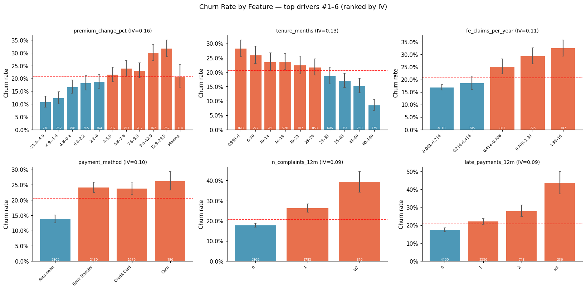

*Figure 1. Churn rate by the strongest drivers (bars: churn rate with 95% CI; dashed line: overall churn rate).*

*Table 1. Driver evidence matrix (univariate, multivariate, survival and SHAP evidence).*

```
                   Driver High-risk group  Churn % (group)  Lift   IV   OR   HR  SHAP rank
           payment method            Cash            26.20  1.27 0.10 2.12 1.75       1.00
               auto renew               0            26.00  1.26 0.09 0.51 0.63       2.00
       premium change pct       12.9–29.5            31.70  1.54 0.16 1.57 1.31       3.00
       number of products               1            23.70  1.15 0.06 0.73 0.82       4.00
        late payments 12m              ≥3            43.60  2.12 0.09 1.36 1.23       6.00
 number of complaints 12m              ≥2            39.30  1.91 0.09 1.30 1.20       7.00
claims per year of tenure         1.39–16            32.50  1.58 0.11 1.08  NaN       8.00
     claim rejection rate             0.5            34.40  1.67 0.08 1.14 1.05      18.00
```

[EDIT: jelaskan 2–3 driver utama dengan bahasa bisnis — kenapa masuk akal di industri asuransi (lihat PLAYBOOK §D2).]


#### Multivariate evidence

Holding other factors constant, payment method = Credit Card (vs 'Auto-debit') changes the odds of churn by +114% (OR = 2.14, 95% CI 1.83–2.51, p <0.001; average marginal effect +10.7 pp).

Holding other factors constant, auto renew (binary (0→1)) changes the odds of churn by -49% (OR = 0.51, 95% CI 0.45–0.57, p <0.001; average marginal effect -9.6 pp).

Holding other factors constant, claims status nunique (binary (0→1)) changes the odds of churn by +77% (OR = 1.77, 95% CI 1.32–2.38, p <0.001; average marginal effect +8.0 pp).

Holding other factors constant, tenure months (per 1 SD (= 22.8)) changes the odds of churn by -37% (OR = 0.63, 95% CI 0.59–0.68, p <0.001; average marginal effect -6.5 pp).


### 3.3 When do customers churn?

Estimated probability of retaining a customer beyond 6 months: 96.7% (Kaplan-Meier).

Estimated probability of retaining a customer beyond 12 months: 92.7% (Kaplan-Meier).

Estimated probability of retaining a customer beyond 24 months: 83.7% (Kaplan-Meier).

Churn hazard is highest in tenure interval [18, 24) months: about 0.95% of active customers churn per month in this period (vs 0.71% on average).

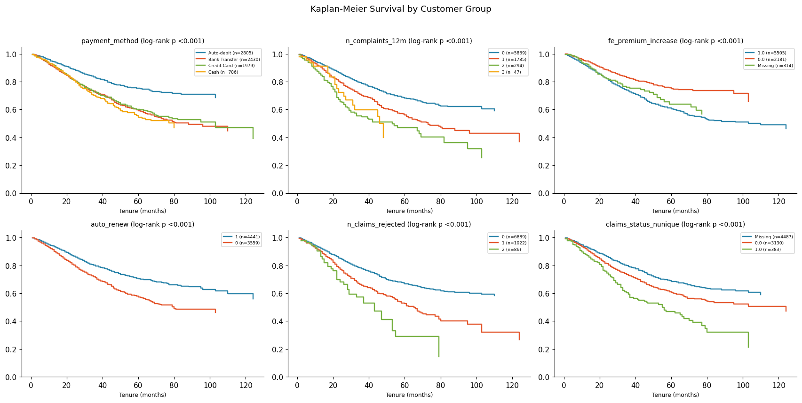

*Figure 2. Kaplan-Meier survival curves by key customer groups (log-rank p-values in titles).*

[EDIT: interpretasi — kapan momen kritis (onboarding? renewal pertama?) dan implikasinya untuk timing intervensi.]


### 3.4 High-risk segments

High-risk segment: IF claims per year of tenure > 0.44 AND payment method ≠ Auto-debit AND number of complaints 12m > 0.50 AND auto renew = 0 THEN churn rate = 57.9% (2.8x average; 221 customers, 2.8% of base, capturing 7.8% of all churners).

High-risk segment: IF claims per year of tenure > 0.44 AND payment method ≠ Auto-debit AND number of complaints 12m > 0.50 AND auto renew = 1 THEN churn rate = 37.8% (1.8x average; 286 customers, 3.6% of base, capturing 6.5% of all churners).

High-risk segment: IF claims per year of tenure > 0.44 AND payment method ≠ Auto-debit AND number of complaints 12m ≤ 0.50 AND auto renew = 0 THEN churn rate = 37.3% (1.8x average; 453 customers, 5.7% of base, capturing 10.2% of all churners).

*Table 2. Highest-risk and most loyal segments identified by a shallow decision tree.*

```
                                                                                           Segment (decision-tree rule)  Customers  Churn %  Lift
claims per year of tenure > 0.44 AND payment method ≠ Auto-debit AND number of complaints 12m > 0.50 AND auto renew = 0        221    57.90  2.81
claims per year of tenure > 0.44 AND payment method ≠ Auto-debit AND number of complaints 12m > 0.50 AND auto renew = 1        286    37.80  1.83
claims per year of tenure > 0.44 AND payment method ≠ Auto-debit AND number of complaints 12m ≤ 0.50 AND auto renew = 0        453    37.30  1.81
 claims per year of tenure ≤ 0.44 AND premium change pct ≤ 5.25 AND tenure months > 61.50 AND number of products > 1.50        210     1.40  0.07
```


### 3.5 Predictive model

The final model (hill_climb) achieves a cross-validated roc_auc of 0.7488 (ROC-AUC 0.7488) versus 0.50 for a random baseline.

At the selected threshold (0.24) the model identifies 60.9% of churners (recall) with a precision of 39.3%, i.e. 1.9x better targeting than random selection.

Final model ROC-AUC = 0.749 (95% bootstrap CI 0.735–0.761).

The final model is not significantly different from the interpretable logistic regression (Δroc_auc = +0.0025, 95% CI -0.0000 to +0.0057).

*Table 3. Cross-validated model comparison.*

```
      Model  OOF roc_auc  CV std  ROC-AUC  PR-AUC
     logreg         0.75    0.01     0.75    0.45
catboost_fs         0.74    0.00     0.74    0.44
   catboost         0.74    0.00     0.74    0.43
       lgbm         0.73    0.00     0.73    0.43
        hgb         0.72    0.01     0.72    0.41
```

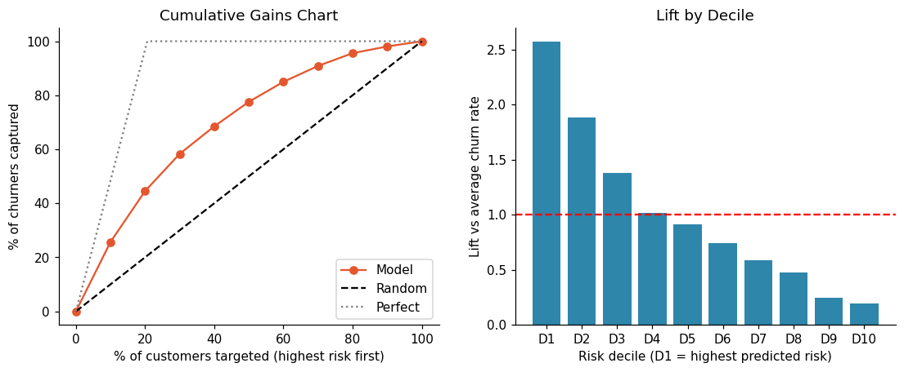

*Figure 3. Cumulative gains and lift by risk decile: the model concentrates churners in the highest-risk deciles.*


### 3.6 Explaining churn risk

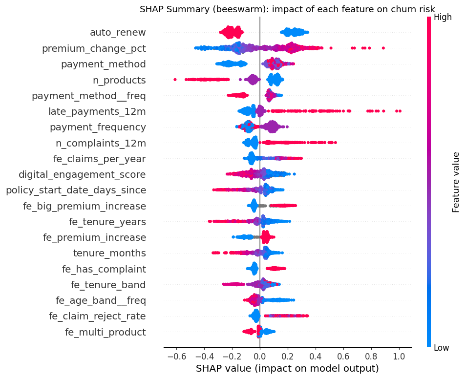

*Figure 4. SHAP summary: each dot is a customer; positive values increase churn risk (colour = feature value).*

Partial dependence: moving premium change pct from -7.40 to 15.50 changes average predicted churn from 15.7% to 24.8%.

Partial dependence: moving number of products from 1.00 to 3.00 changes average predicted churn from 21.1% to 14.0%.

Partial dependence: moving late payments 12m from 0.00 to 2.00 changes average predicted churn from 17.6% to 26.0%.

[EDIT: hubungkan SHAP dengan temuan statistik — driver mana yang konsisten di semua metode (robust).]


## 4. Business Impact and Recommendations


### 4.1 Value at risk and prioritisation

Targeting the top 20% highest-risk customers captures 44.5% of all churners (2.2x lift over random targeting); the top decile churns at 53.0% vs 4.0% in the bottom decile. KS = 0.37.

The High-risk tier (20% of customers, p ≥ 0.31) has an actual churn rate of 45.9% and contains 44.5% of all churners.

Expected annual premium at risk from churn is 9.83B IDR (20.5% of the annual premium base); the High-risk tier alone accounts for 41.8% of it.

'Priority Save' customers (high risk & above-median value) are 9.6% of the base but hold 28.3% of the value at risk — the first target for personalised retention.

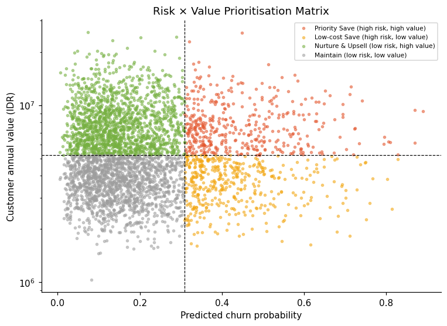

*Figure 5. Risk × value matrix: 'Priority Save' customers combine high churn risk with above-median value.*


### 4.2 Retention campaign simulation

Simulated retention campaign (assumed success rate 30%, cost 150.00K IDR per contact): targeting the top 50% ranked by 'Model: expected loss (p × value)' maximises net profit at 792.88M (ROI 1.3x), versus 207.55M for random targeting of the same size.

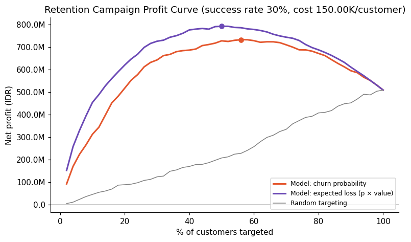

*Figure 6. Net profit of a retention campaign by share of customers targeted (model vs random targeting).*

[EDIT: sebutkan asumsi bisnis — margin 20%, cost per contact 150.00K IDR, success rate 30% — dan sumbernya (soal / asumsi wajar); rujuk tabel sensitivity di Appendix.]


### 4.3 What-if scenarios

What-if: 'Move all 'payment method' customers to 'Auto-debit'' affects 66% of customers and lowers their predicted churn from 22.8% to 14.9%; at 30% adoption this avoids ≈16 churners per 1,000 customers (model-based, associational).

What-if: 'Set auto renew = 1 for everyone' affects 44% of customers and lowers their predicted churn from 24.0% to 17.0%; at 30% adoption this avoids ≈9 churners per 1,000 customers (model-based, associational).

What-if: 'Cap premium change pct at median (4)' affects 48% of customers and lowers their predicted churn from 23.9% to 19.9%; at 30% adoption this avoids ≈6 churners per 1,000 customers (model-based, associational).

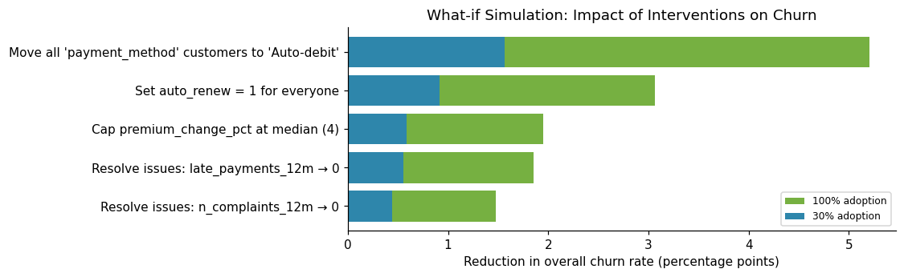

*Figure 7. Model-based simulation of interventions (associational, to be validated by pilots).*


### 4.4 Churn personas

Persona P1 (55% of at-risk customers, actual churn 35.8%): risk driven mainly by auto renew (+0.25); payment method (+0.07); premium change pct (+0.06).

Persona P2 (45% of at-risk customers, actual churn 30.0%): risk driven mainly by payment method (+0.11); premium change pct (+0.09); late payments 12m (+0.04).

[EDIT: beri nama tiap persona (misal 'Price-shocked renewers', 'Service-frustrated claimants') + 1 intervensi khusus per persona.]


### 4.5 Recommendations

*Table 4. Evidence-based retention recommendations.*

```
 #                                 Recommendation                                                                        Evidence                                                               Expected impact                                                           KPI
 1       Shift manual payers to automatic payment      'Cash' churns at 26.2% (1.3x avg); IV 0.10; OR 2.12; HR 1.75; SHAP rank #1 -5.21 pp churn at full adoption (≈16 churners avoided /1,000 at 30% adoption) % of policies on auto-pay; lapse rate of converted vs control
 2 Make renewal effortless (default auto-renewal)         '0' churns at 26.0% (1.3x avg); IV 0.09; OR 0.51; HR 0.63; SHAP rank #2  -3.06 pp churn at full adoption (≈9 churners avoided /1,000 at 30% adoption)                             Auto-renew adoption; renewal rate
 3                        Smarter renewal pricing '12.9–29.5' churns at 31.7% (1.5x avg); IV 0.16; OR 1.57; HR 1.31; SHAP rank #3  -1.95 pp churn at full adoption (≈6 churners avoided /1,000 at 30% adoption)   Churn rate among customers with increases; price elasticity
 4 Bundling & cross-sell to raise switching costs         '1' churns at 23.7% (1.2x avg); IV 0.06; OR 0.73; HR 0.82; SHAP rank #4                                                                                           Products per customer; churn of bundled vs single
 5            Early-warning on payment difficulty        '≥3' churns at 43.6% (2.1x avg); IV 0.09; OR 1.36; HR 1.23; SHAP rank #6  -1.85 pp churn at full adoption (≈6 churners avoided /1,000 at 30% adoption)    Cure rate of late payers; lapse after first missed payment
 6                   Complaint recovery programme        '≥2' churns at 39.3% (1.9x avg); IV 0.09; OR 1.30; HR 1.20; SHAP rank #7  -1.47 pp churn at full adoption (≈4 churners avoided /1,000 at 30% adoption)         Complaint resolution time; churn rate of complainants
 7                  Improve the claims experience      '0.5' churns at 34.4% (1.7x avg); IV 0.08; OR 1.14; HR 1.05; SHAP rank #18                                                                                     Claim settlement days; post-claim churn rate; claim NPS
 8            Deploy a churn early-warning system                           Model ROC-AUC 0.749; top-20% captures 45% of churners                                optimal campaign: target top 50% → net 792.88M Precision/recall of alerts; retained revenue vs control group
 9    Validate with controlled pilots (A/B tests)                                               What-if results are associational                                                                                                Uplift in retention rate (treated − control)
```

1. Shift manual payers to automatic payment. Offer a small incentive (e.g. premium discount/cashback) and one-click enrolment for auto-debit/recurring card payment; send pre-due reminders to remaining manual payers.

2. Make renewal effortless (default auto-renewal). Default new and renewing policies to auto-renewal with clear opt-out; 30/14/7-day renewal reminders with a one-click renew link.

3. Smarter renewal pricing. Cap or phase in premium increases for at-risk loyal customers, explain the value behind increases, and offer coverage/deductible adjustments instead of lapse.

4. Bundling & cross-sell to raise switching costs. Offer multi-policy discounts and relevant riders to single-product customers with good risk profiles.

5. Early-warning on payment difficulty. Treat the first late payment as a churn signal: friendly reminders, flexible instalments or payment-date change, and grace-period outreach before lapse.

[EDIT: tambahkan roadmap — Quick wins (0–3 bulan), Medium (3–6 bulan), Long term (6–12 bulan) — dan rencana pengukuran (A/B test dengan control group).]


## 5. Conclusion and Limitations

Churn at PT Asuransi Sejahtera is driven primarily by payment method, auto renew, premium change pct, and is concentrated in identifiable segments and lifecycle stages. A validated predictive model (ROC-AUC of 0.749 (95% CI 0.735–0.761)) enables proactive, value-based retention targeting. [EDIT: 1–2 kalimat jawaban langsung untuk 3 pertanyaan riset.]

Limitations: (i) the data are a single snapshot, so relationships are associational rather than causal; (ii) the ROI simulation relies on assumed costs and success rates (see sensitivity analysis); (iii) potentially important factors such as competitor offers and life events are not observed. Future work should validate interventions through randomised pilots and enrich the data with [EDIT: interaction logs / stated reasons for leaving].


## References

Akiba, T., Sano, S., Yanase, T., Ohta, T., & Koyama, M. (2019). Optuna: A next-generation hyperparameter optimization framework. Proceedings of the 25th ACM SIGKDD Conference, 2623–2631.

Benjamini, Y., & Hochberg, Y. (1995). Controlling the false discovery rate. Journal of the Royal Statistical Society: Series B, 57(1), 289–300.

Caruana, R., Niculescu-Mizil, A., Crew, G., & Ksikes, A. (2004). Ensemble selection from libraries of models. Proceedings of ICML 2004.

Cox, D. R. (1972). Regression models and life-tables. Journal of the Royal Statistical Society: Series B, 34(2), 187–220.

Kaplan, E. L., & Meier, P. (1958). Nonparametric estimation from incomplete observations. Journal of the American Statistical Association, 53(282), 457–481.

Ke, G., et al. (2017). LightGBM: A highly efficient gradient boosting decision tree. Advances in Neural Information Processing Systems, 30.

Lundberg, S. M., & Lee, S.-I. (2017). A unified approach to interpreting model predictions. Advances in Neural Information Processing Systems, 30.

Prokhorenkova, L., Gusev, G., Vorobev, A., Dorogush, A. V., & Gulin, A. (2018). CatBoost: Unbiased boosting with categorical features. Advances in Neural Information Processing Systems, 31.

Verbeke, W., Dejaeger, K., Martens, D., Hur, J., & Baesens, B. (2012). New insights into churn prediction in the telecommunication sector: A profit driven data mining approach. European Journal of Operational Research, 218(1), 211–229.


---


## Appendix (not counted in the page limit)

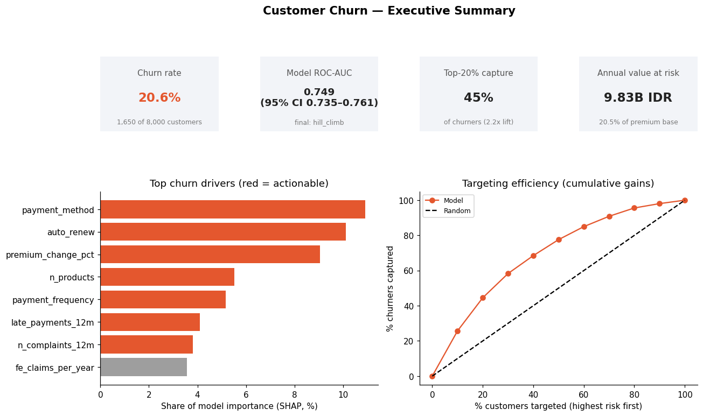

*Figure 8. Executive summary dashboard.*

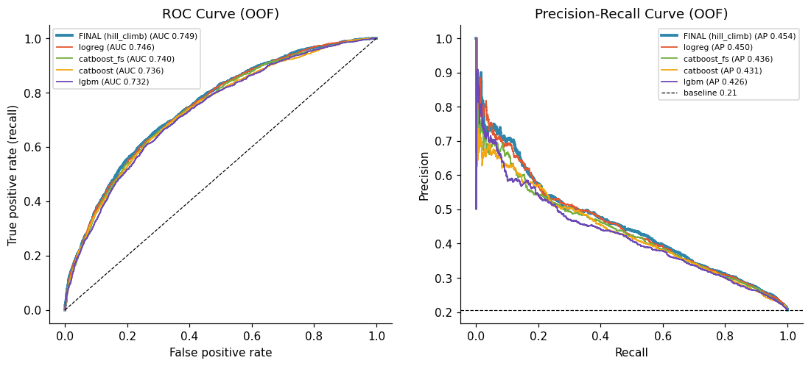

*Figure 9. ROC and precision–recall curves (out-of-fold).*

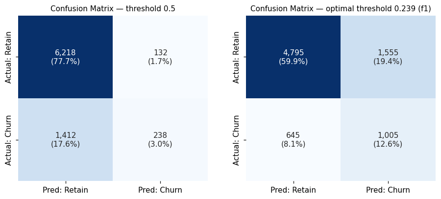

*Figure 10. Confusion matrices at 0.5 and at the optimised threshold.*

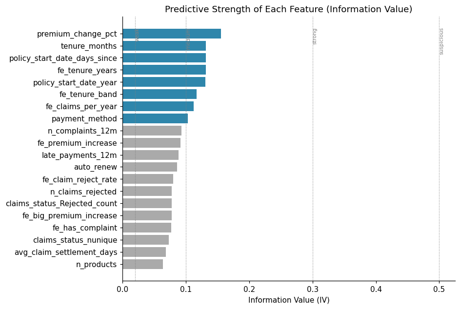

*Figure 11. Information Value of each feature.*

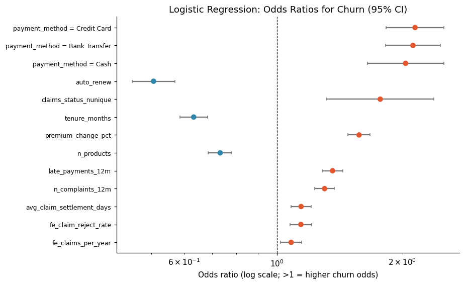

*Figure 12. Logistic regression odds ratios (95% CI).*

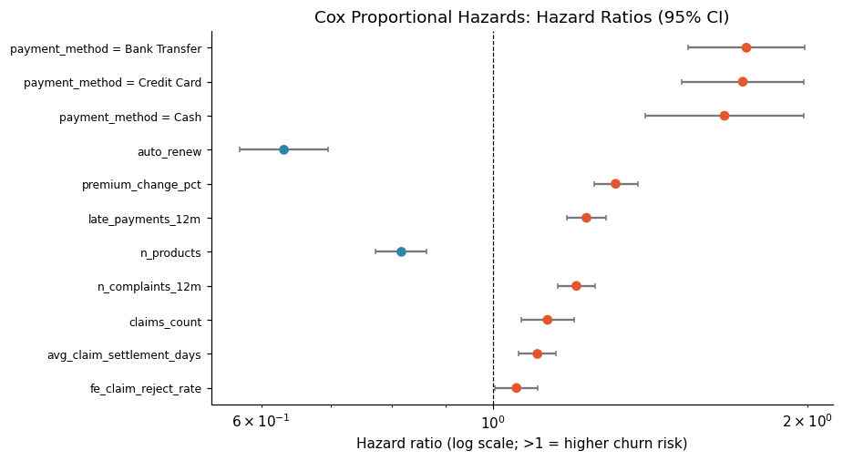

*Figure 13. Cox proportional hazards: hazard ratios (95% CI).*

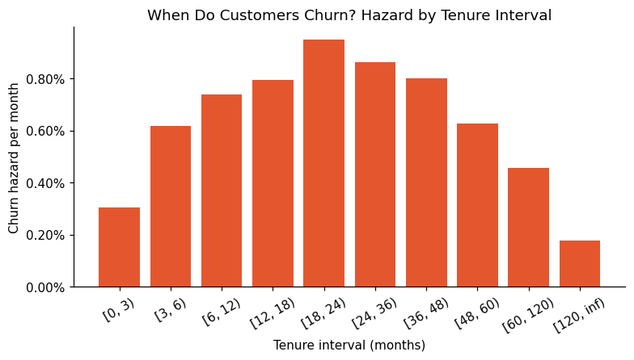

*Figure 14. Churn hazard by tenure interval.*

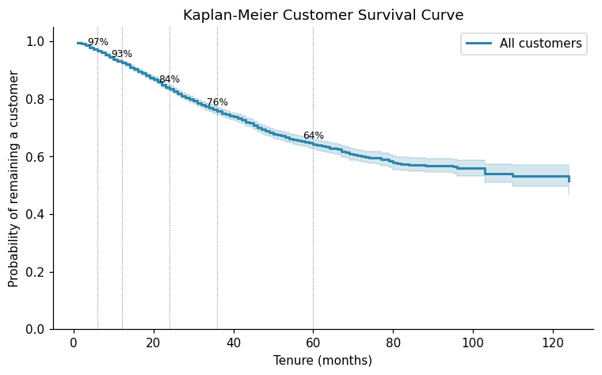

*Figure 15. Overall Kaplan-Meier curve.*

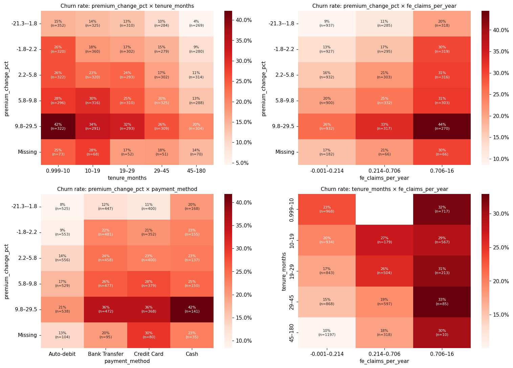

*Figure 16. Two-way churn-rate heatmaps.*

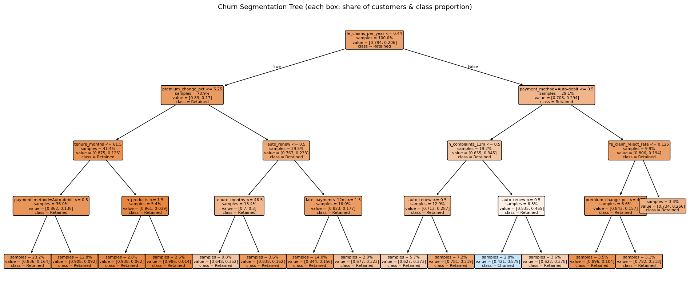

*Figure 17. Churn segmentation tree.*

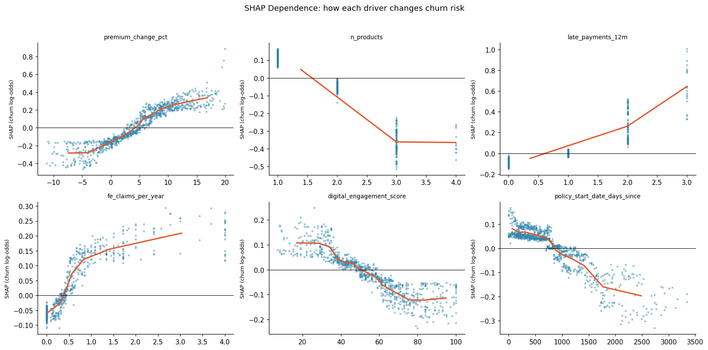

*Figure 18. SHAP dependence plots.*

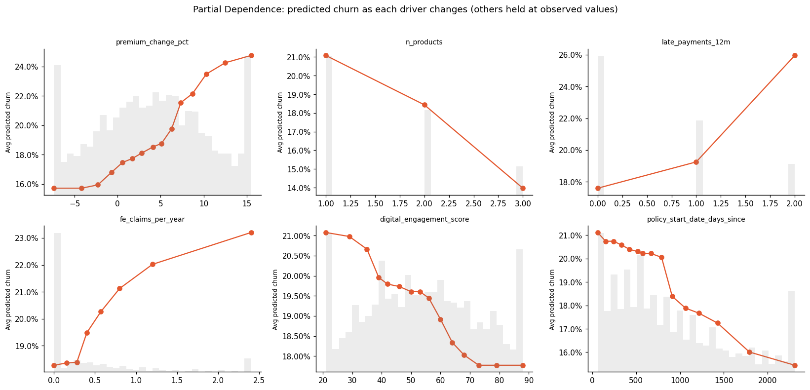

*Figure 19. Partial dependence plots.*

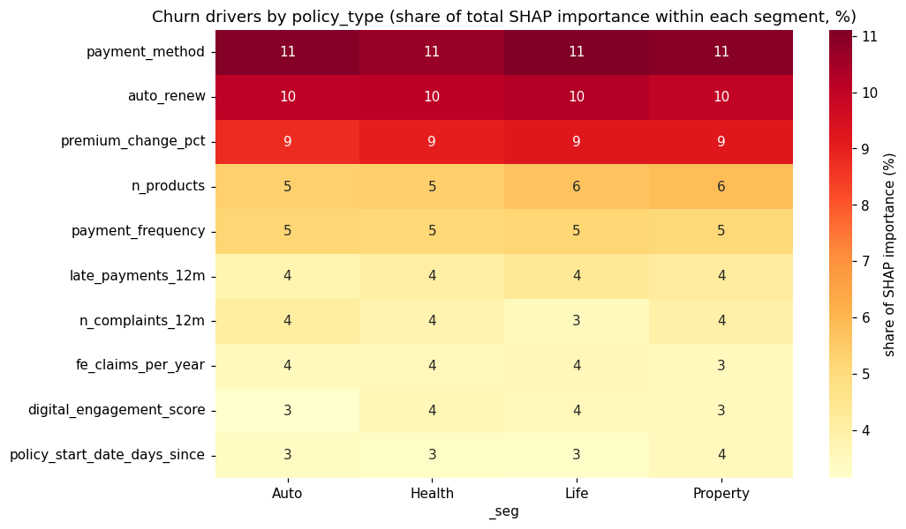

*Figure 20. Driver importance by segment.*

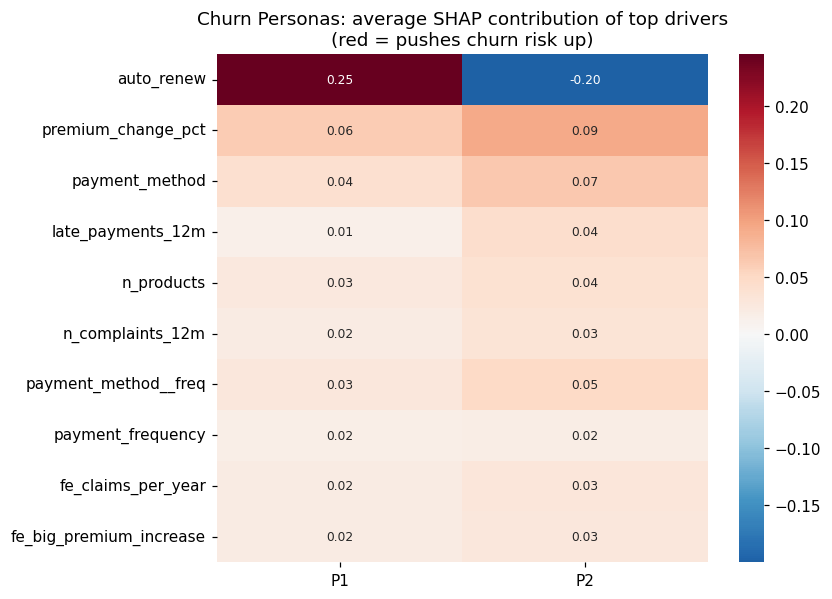

*Figure 21. Churn personas (SHAP clustering).*

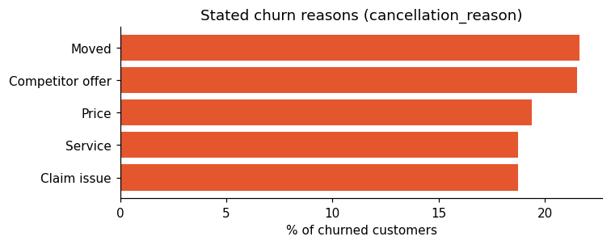

*Figure 22. Stated churn reasons.*

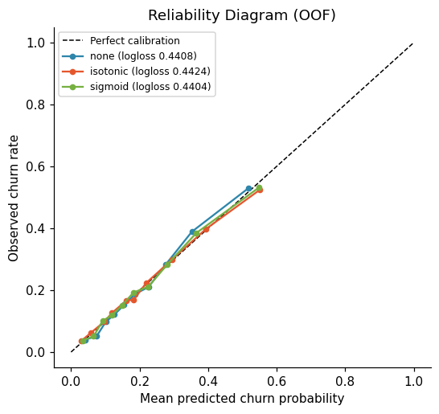

*Figure 23. Calibration (reliability) diagram.*

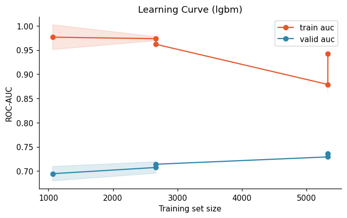

*Figure 24. Learning curve.*

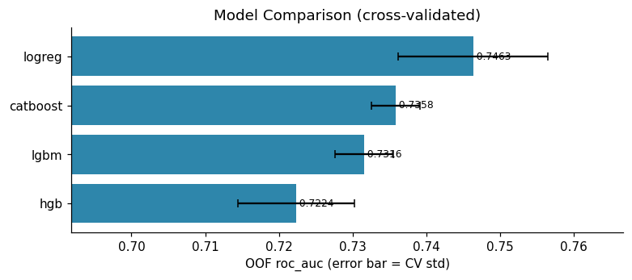

*Figure 25. Model comparison chart.*

*Table 5. Risk tiers.*

```
  tier  n_train  actual_churn_rate  avg_predicted  share_churners_%  n_test
  High     1600               0.46           0.43             44.55     422
Medium     2400               0.23           0.23             33.03     590
   Low     4000               0.09           0.10             22.42     988
```

*Table 6. Campaign sensitivity analysis.*

```
 success_rate  cost_per_contact  optimal_target_%   max_net_profit  roi
         0.15         75,000.00             51.00   397,015,927.20 1.30
         0.15        150,000.00             26.50   191,372,754.80 0.60
         0.15        300,000.00              6.08    57,413,369.87 0.39
         0.30         75,000.00             75.50 1,169,435,881.80 2.58
         0.30        150,000.00             51.00   794,031,854.40 1.30
         0.30        300,000.00             26.50   382,745,509.61 0.60
         0.45         75,000.00             87.75 2,005,807,740.80 3.81
         0.45        150,000.00             67.33 1,539,554,179.74 1.91
         0.45        300,000.00             38.75   919,714,550.51 0.99
```

*Table 7. What-if scenario results.*

```
                                           scenario                  feature  affected_%  churn_affected_before  churn_affected_after  overall_reduction_pp_full  overall_reduction_pp_30pct_adoption  churners_avoided_per_1000
Move all 'payment method' customers to 'Auto-debit'           payment method       65.95                   0.23                  0.15                       5.21                                 1.56                      15.63
                    Set auto renew = 1 for everyone               auto renew       43.76                   0.24                  0.17                       3.06                                 0.92                       9.18
               Cap premium change pct at median (4)       premium change pct       48.18                   0.24                  0.20                       1.95                                 0.58                       5.85
              Resolve issues: late payments 12m → 0        late payments 12m       43.05                   0.24                  0.20                       1.85                                 0.56                       5.56
       Resolve issues: number of complaints 12m → 0 number of complaints 12m       25.95                   0.28                  0.22                       1.48                                 0.44                       4.42
```

*Table 8. Churn persona profiles.*

```
persona  n_in_sample  share_of_at_risk_%  avg_pred_churn  actual_churn_rate                                                                   top_drivers payment method  auto renew
     P1          285               54.60            0.34               0.36        auto renew (+0.25); payment method (+0.07); premium change pct (+0.06)  Bank Transfer        0.00
     P2          237               45.40            0.29               0.30 payment method (+0.11); premium change pct (+0.09); late payments 12m (+0.04)  Bank Transfer        1.00
```

*Table 9. Paired bootstrap comparison of models.*

```
   final_vs  diff_roc_auc  ci_low  ci_high  p_value_one_sided  significant
     logreg          0.00   -0.00     0.01               0.03        False
catboost_fs          0.01    0.01     0.01               0.00         True
   catboost          0.01    0.01     0.02               0.00         True
       lgbm          0.02    0.01     0.02               0.00         True
```
